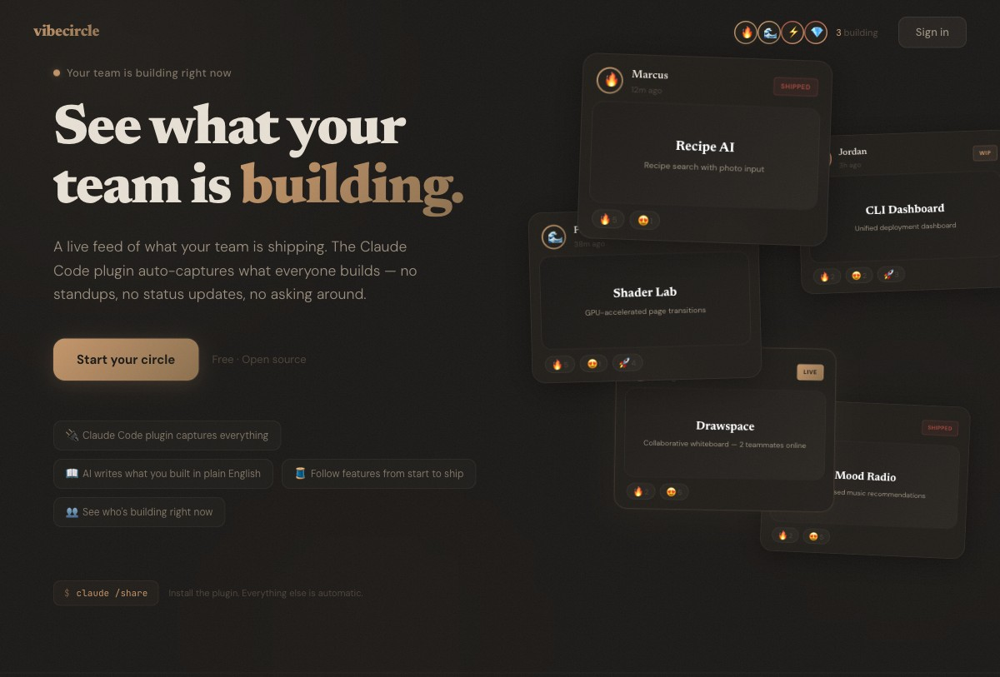

<div align="center">

# vibecircle

### Vibe coding is the most interesting creative activity happening right now. But it's solo.

**vibecircle makes it social.**

A Claude Code plugin + live feed that shows what your friends and teammates are building — as it happens.

[vibecircle.dev](https://vibecircle.dev) · [Install the Plugin](#install) · [Run it Yourself](#self-host)

</div>

---



---

## The idea

You're building something with Claude Code. Your friend is building something too. Your teammate just shipped. But nobody knows — until a standup, a Slack message, or someone asks.

Vibecircle sits in the background. A Claude Code plugin watches your session and detects when something interesting happens — a new UI, a deploy, a big feature landing. It writes a plain-English summary of what you built, shows you a preview, and shares it to your circle if you approve.

Your friends see it. Your team sees it. A PM can follow a feature from start to ship without asking a single question.

**No commit counts. No jargon. Just the story of what's being built.**

---

## How it works

```
You code with Claude
        ↓
Plugin detects something worth sharing
        ↓
Claude writes a headline + description (in plain English)
        ↓
You approve → posted to your circle's feed
        ↓
Friends and teammates see it instantly
```

The plugin is the engine. The feed is the output. You barely have to think about it.

---

## What makes it different

| | Traditional | vibecircle |
|---|---|---|
| **How updates happen** | Standups, Slack, "what are you working on?" | Automatic — the plugin captures as you build |
| **Who can read it** | Engineers reading diffs | Anyone — AI writes human-readable descriptions |
| **Granularity** | End-of-sprint demos | Real-time — see features evolve from WIP to shipped |
| **Effort** | Write a status update | Approve a preview (or skip it) |

---

## Features

**Smart plugin** — a sentinel watches your session and detects share-worthy moments. First deploy? New UI? Big feature? It proposes sharing. Config changes and dependency updates? It stays quiet. And nothing ever posts without your approval — you always see a preview first.

**AI ghost-writer** — Claude writes every headline and description. "Built a settings page with dark mode and notification preferences" — not "refactored SettingsProvider component tree." Written for humans, not machines.

**Narrative arcs** — related posts are grouped into stories. A PM watches "Payment Integration" go from Stripe setup → pricing page → subscriptions live, without attending a single meeting.

**Screenshots** — the plugin uses Playwright to capture what you're building. Frontend work gets a screenshot. Backend work gets a richer description instead.

**Ambient presence** — see who's building right now, who just shipped, who's away.

**Reactions & comments** — async energy. Fire emoji a friend's deploy. Ask a question about a teammate's feature.

---

<a id="install"></a>

## Get started

### 1. Sign up

Go to [vibecircle.dev](https://vibecircle.dev) and sign in with GitHub.

### 2. Create a circle

A circle is a private group — your friend crew, your eng team, your side-project squad.

### 3. Install the plugin

In Claude Code:

```
/plugin marketplace add miltonian/vibecircle
/plugin install vibecircle
/circle setup
```

That's it. The setup page guides you through authorizing the plugin. Takes 10 seconds.

### 4. Build something

The plugin runs in the background. When it detects something interesting, it'll show you a preview:

```
vibecircle — Ready to share:

  Redesigned the landing page with warm editorial aesthetic
  Replaced neon gradients with a premium journal feel. Serif headlines,
  copper accents, and floating post cards with warm tones.

  📸 Screenshot attached · Part of "Design Overhaul"

Share this? [Y]es · [E]dit · [S]kip
```

Press Y. Your circle sees it.

---

<a id="self-host"></a>

## Run it yourself

```bash
git clone https://github.com/miltonian/vibecircle.git
cd vibecircle
bun install
cp apps/web/.env.example apps/web/.env.local
# fill in env vars (DATABASE_URL, AUTH_SECRET, GITHUB_ID, GITHUB_SECRET)
bun run db:push
bun run seed
bun run dev
```

See [CONTRIBUTING.md](CONTRIBUTING.md) for full setup instructions.

---

## Architecture

**Monorepo** — `apps/web` (Next.js) + `packages/plugin` (Claude Code plugin)

**Plugin** — prompt-based hooks that run inside Claude Code. The sentinel analyzes your session, the ghost-writer drafts posts, the context engine tracks narrative arcs. All AI runs locally in your Claude session — zero cost for vibecircle.

**Web** — Next.js 16, Drizzle ORM, Neon Postgres, Vercel Blob, Auth.js, SWR polling at 4s intervals.

See [docs/specs/design.md](docs/specs/design.md) for the full design spec.

## Tech stack

Next.js 16 · Tailwind CSS · shadcn/ui · Drizzle ORM · Neon Postgres · Auth.js · Vercel Blob · Bun · Turborepo

---

## Contributing

See [CONTRIBUTING.md](CONTRIBUTING.md). PRs welcome.

Open source under [MIT License](LICENSE).

---

<div align="center">

Built with [Claude Code](https://claude.ai/code)

</div>
